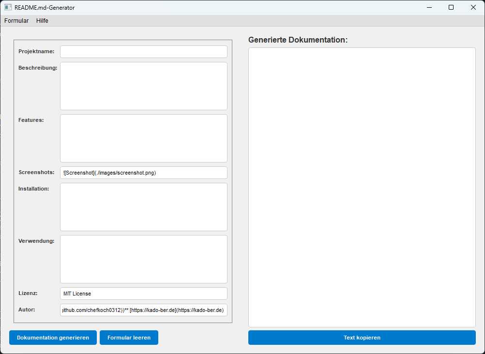

# **📦 readme.md_generator**

Hilft beim Erstellen von MD-Files (README.md)
Die Felder Screenshots, Lizenz und Autor sind bereits vorausgefüllt - diese bitte in jedem Fall an die eigenen Gegebenheiten anpassen (Bereiche im Code sind markiert mit: # hier bitte anpassen). Ist nur provisorisch, Auslagerung in eine Config-Datei folgt später.

## **🚀 Features**

- Auswahl zwischen minimal- und voll-version der jeweiligen README.md

## **🖼️ Screenshots**

## **⚙️ Installation**

git clone https://github.com/chefkoch0312/readme_generator

## **▶️ Verwendung**

python readme_generator

## **🧾 Lizenz**

MIT License

## **👤 Autor**

**Kai ([@chefkoch0312](https://github.com/chefkoch0312))**
[https://kado-ber.de](https://kado-ber.de)
